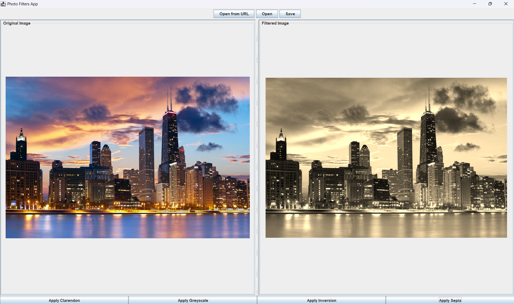
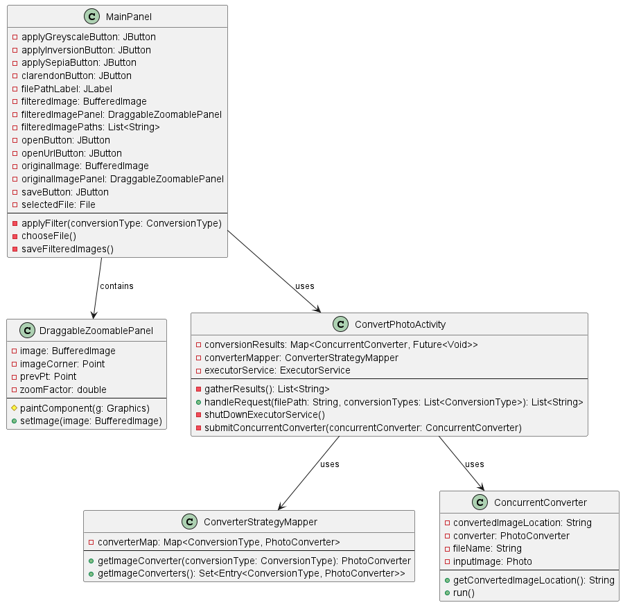
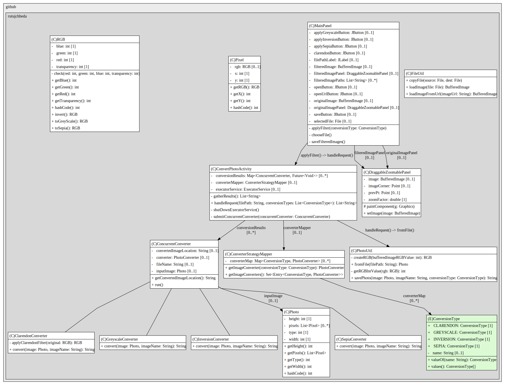
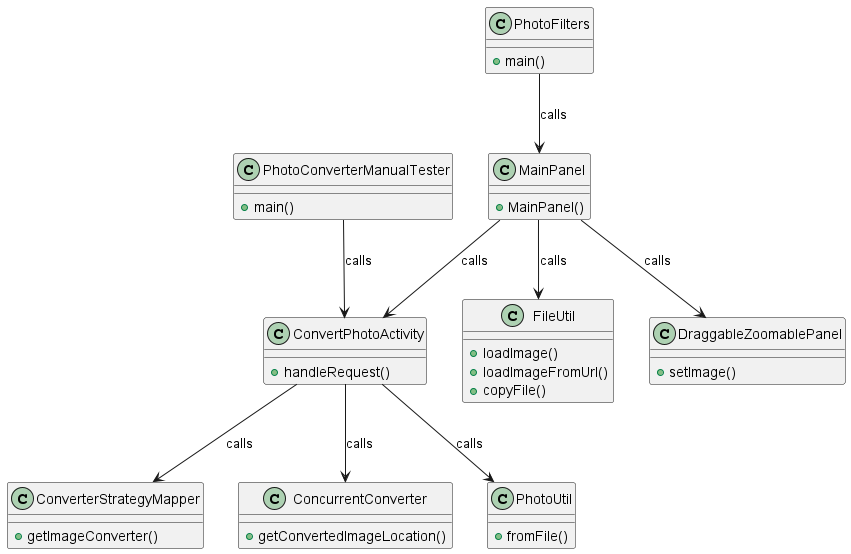

# Photo Filters App

This is a sample Java application that allows users to apply different filters to their photos.
The application allows users to load an image from their local file system, apply filters to the image, and save the filtered image back to their local file system.

#### Key Features
- **User-Friendly Interface:** Built with Java Swing for a familiar and intuitive experience.
- **Image Manipulation:** Leverages Java AWT for efficient image processing.
- **Clean Architecture:**  Employs the Model-View-Controller (MVC) pattern for well-organized code.
- **Dependency Injection:** Uses Dagger for streamlined dependency management.
- **Build Automation:**  Powered by Apache Maven for easy project setup and management.

#### User Stories
- A user can load an image from their local file system by clicking the `Open` button.
- The user can apply a filter to the loaded image by selecting a filter from the drop-down menu and clicking the `Apply Filter` button.
- The user can save the filtered image to their local file system by clicking the `Save` button.
- The user can also drag and drop an image file onto the application to load the image.


Currently, the application supports the following filters:
- Grayscale
- Sepia
- Invert
- Clarendon



## Getting Started

These instructions will get you a copy of the project up and running on your local machine for development and testing purposes.

#### The full version of this application can be run locally by following the instructions below.
 
- Using the CLI, navigate to the project directory and run the following command to build the application:
```bash
/bin/bash -c "$(curl -fsSL https://www.jdeploy.com/gh/RutujChheda/PhotoFilters/master/install.sh)"
```
- Download the Native Application Install Bundler from [here](https://github.com/RutujChheda/PhotoFilters/releases)
```url
https://github.com/RutujChheda/PhotoFilters/releases
```

#### A limited cheerpJ version of this application is available [here](https://rutujchheda.github.io/PhotoFilters/master/) to get a feel of the application in your browser.
- Please note that the cheerpJ version has limited functionality and may not work as expected on all browsers.
- The cheerpJ version is intended for demonstration purposes only and may not be suitable for production use.
- For the best experience, it is recommended to run the full version of the application locally on your machine.


## Architecture Diagrams

### PhotoFiltersApp Structure

[Project Structure](src/main/resources/PhotoFilters_Structure.puml)

### PhotoFiltersApp Detailed Structure

[Project Structure](src/main/resources/PhotoFilters_Detailed_Structure.puml)

### PhotoFiltersApp Main Calls

[Project Calls Sequence](src/main/resources/PhotoFilters_Calls.puml)


### Contributing
Pull requests are welcome. For major changes, please open an issue first to discuss what you would like to change.

Please make sure to update tests as appropriate.

### How to Contribute:
1. Fork the repository.
2. Create a new branch for your feature or bug fix.
3. Make your changes and commit them with clear descriptions.
4. Push your changes to your fork.